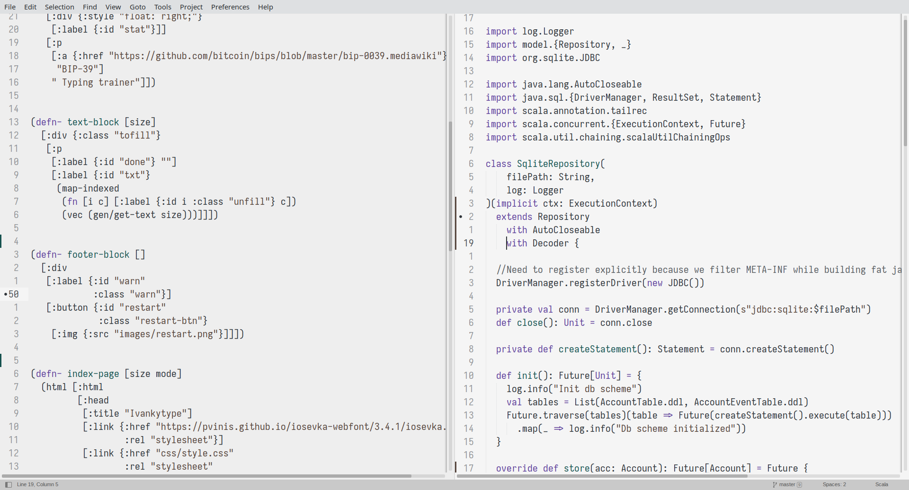

# Mindre Color Scheme

Port of [mindre-theme](https://github.com/erikbackman/mindre-theme) for Sublime Text 4.

# Installation
## Via Package Control
First, add Mindre Repository via Package Control:

`Tools` → `Command Palette...` → `Package Control: Add Repository`
put `https://github.com/Prikaz98/sublime-scheme-mindre` in appeared input field

Second, install Mindre via Package Control:

`Tools` → `Command Palette...` → `Package Control: Install Package`

Select `sublime-scheme-mindre` and press Enter.

Then, enable it:

Select `Preferences` → `Select Color Scheme ...`

Pick Mindre
